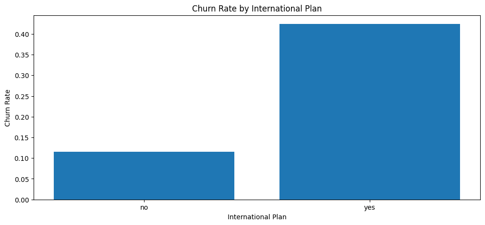
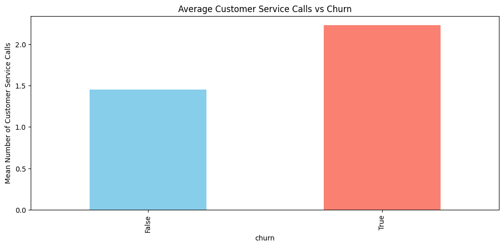
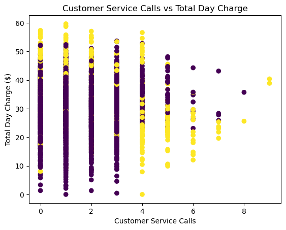

# Phase-3-Project-Machine-Learning

Analysis of Churn in Telecom's dataset
Phase 3 Project
Eliud Kibet

## Overview

In this project I analyze customer data from a select Telecom company to predict which customers are likely to leave the company (churn). The goal of this project is to help the company identify customers at risk of leaving and take action to keep them, such as offering better plans or improved service.

## Business Understanding

Telecom companies lose revenue whenever their customers cancel service and this project wil this help the stakeholders to undertake the following three aspects:

a) Understand why customers leave
b) Predict which customers will  leave
c) Find ways to reduce customer loss

By using this data obtained from https://www.kaggle.com/datasets/becksddf/churn-in-telecoms-dataset?resource=download I will attempt to build a model that predicts churn and give practical recommendations to the business.

## Data
The dataset contains information about 3,333 customers where each row represents one customer

**Key columns include:**
- `state`, `area code`, `phone number`, `account length`, `international plan`, `voice mail plan`, `customer service calls` and `churn`

## Methodology

This project entailed the following tasks:
1. Exploratory Data Analysis (EDA) to Understand patterns in the data
2. There was no data cleaning done since there were no missing values. However at the point of model creation we dropped some columns to rmain with the most relevant features.
4. Modeling: tried two different machine learning models (a- Logistic regression and 2) Decision Tree to predict churn
5. Evaluation: Used metrics like Accuracy, Recall, Precision and F1-score
6. Recommendations: Based on model insights

## Key Insights from EDA
The following were observed from the EDA:
- International Plan: Customers who have an international plan are more likely to churn compared to those who don not.
- Customer Service Calls: Customers with a high number of customer service calls have a much higher chance of churning. This is one of the strongest indicators.
- Day Charges: Customers with higher day charges show different churn behavior, suggesting that heavy daytime users may be more sensitive to pricing

## Plots from EDA

## Models

I tested two models:
- Logistic Regression
- Decision Tree

I focused on Accuracy, Recall, Precision and F1-score although recall seemed the most useful metric for the churn class because the business cares more about correctly identifying customers who will leave.

**Best Model**: Decision Tree
**Performance**:
- Accuracy: 91.3%
- Churn Recall: 94% (most important)

## Conclusion & Recommendations

The analysis shows that the most important factors driving churn are:

1. Number of customer service calls
2. International plan usage
3. Total day/evening charges

**Recommendations for the company:**
- Improve customer service to reduce complaints
- Offer special discounts or better international rates to at-risk customers
- Target customers with high usage but low satisfaction
- Focus retention efforts on newer customers (low account length)

## Next Steps

- There is need for collection of  more recent data given the changes that has happened in the sector since this sample data was collected

- There is need to include additional features such as complaints to the model to determine their influence on the model prediction

- Consider running A/B test retention offers for predicted churners

